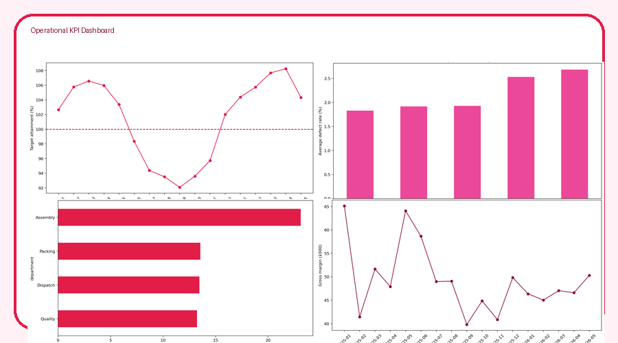
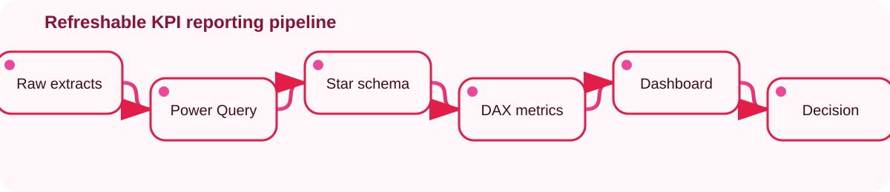

<div align="center">

[](#)
[](#)
[](#)
[](#)
[](https://fowziafaria1234-ops.github.io/operational-kpi-dashboard/dashboard/)
</div>

## 🌹 Project overview

A portfolio reconstruction of a refreshable operational KPI dashboard. It demonstrates how raw extracts can be cleansed, validated, modelled into a star schema and translated into decision-ready measures.

> **Data transparency:** The dataset is synthetic and generated with a fixed seed. It intentionally contains quality issues so the cleansing and validation work can be reviewed.



## 📌 Demonstration results

| KPI | Result |
|---|---:|
| Target attainment | **101.1%** |
| Defect rate | **2.07%** |
| On-time rate | **74.5%** |
| Gross margin | **£837,450** |
| Best on-time site | **Unknown** |

## 🧭 Analytics workflow



## 🗂️ Repository structure

```text
operational-kpi-dashboard/
├── assets/                 # Preview images and animated SVGs
├── dashboard/index.html    # Interactive browser dashboard
├── data/raw/               # Deliberately imperfect synthetic extract
├── data/processed/         # Clean data, dimensions, fact table and KPIs
├── docs/PROJECT_REPORT.md  # Business-facing report
├── notebooks/              # Reproducible Jupyter walkthrough
├── power-bi/               # DAX, Power Query M and model notes
├── src/                    # Data generation and analysis pipeline
└── tests/                  # KPI validation tests
```

## ▶️ Run locally

```bash
python -m venv .venv
# Windows: .venv\Scripts\activate
# macOS/Linux: source .venv/bin/activate
pip install -r requirements.txt
python src/run_pipeline.py
pytest -q
```

Open `dashboard/index.html` in a browser to view the animated dashboard.

## 💼 Skills demonstrated

Power BI concepts · DAX · Power Query · Star-schema modelling · KPI definition · Data validation · Python automation · Trend analysis · Stakeholder reporting · Reproducibility

## 📄 More detail

- [Project report](./docs/PROJECT_REPORT.md)
- [Data dictionary](./DATA_DICTIONARY.md)
- [DAX measures](./power-bi/measures.dax)
- [Power Query script](./power-bi/power_query.m)

---

<div align="center">Made with 🌹 by <a href="https://github.com/fowziafaria1234-ops">Faria Islam</a></div>
